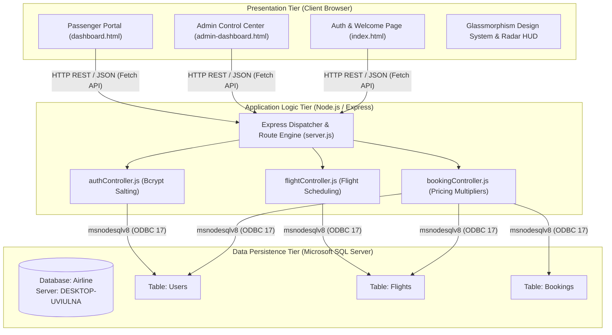
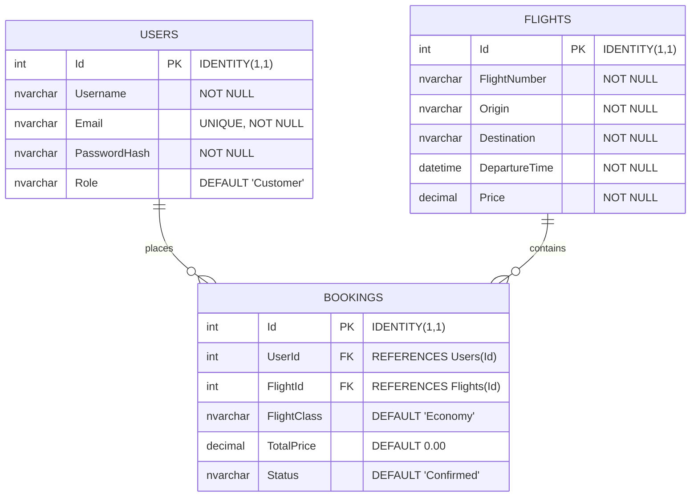

# ✈️ SkyWings Airlines: Enterprise Ticket Booking & Fleet Management System
## Comprehensive Software Engineering & System Architecture Documentation


---

## 📋 Table of Contents
1. [Executive Summary & Project Overview](#1-executive-summary--project-overview)
2. [System Architecture & Data Flow](#2-system-architecture--data-flow)
3. [Software Requirements Specification (SRS)](#3-software-requirements-specification-srs)
4. [Database Design & Data Dictionary](#4-database-design--data-dictionary)
5. [RESTful API Endpoint Reference](#5-restful-api-endpoint-reference)
6. [Frontend Engineering & Animation Engine](#6-frontend-engineering--animation-engine)
7. [Security & Authentication Architecture](#7-security--authentication-architecture)
8. [Comprehensive Verification & Test Suite Matrix](#8-comprehensive-verification--test-suite-matrix)
9. [Installation, Setup & Deployment Guide](#9-installation-setup--deployment-guide)
10. [Repository Structure & Codebase Map](#10-repository-structure--codebase-map)
11. [Troubleshooting & Frequently Asked Questions](#11-troubleshooting--frequently-asked-questions)
12. [Conclusion & Future Roadmap](#12-conclusion--future-roadmap)

---

## 1. Executive Summary & Project Overview

### 1.1 Project Purpose & Vision
**SkyWings Airlines** is an enterprise-grade flight discovery, multi-tier ticket reservation, and administrative airline operations management system. The platform bridges a modern, lightweight, glassmorphism-inspired web client with a high-throughput Node.js/Express backend connected to **Microsoft SQL Server (MSSQL)** via **Windows Integrated Authentication**.

### 1.2 Key Differentiating Features
* **Dual Role-Based Workflows:** Distinct, secure interfaces tailored for everyday **Passengers** (discovery, booking, boarding passes) and **Operations Administrators** (analytics, flight publishing, passenger reservation supervisor).
* **Multi-Tier Dynamic Fare Engine:** Real-time computation of seat tier multipliers:
  * **Economy Class:** 1.0x Base Fare (Standard Seating, 23kg Baggage, In-Flight Snack).
  * **Business Class:** 2.0x Base Fare (Priority Check-In, Lounge Access, Gourmet Dining).
  * **First Class:** 3.0x Base Fare (Private Lie-Flat Suite, Chauffeur Service, Fine Champagne).
* **Authentic Aviation Vector Graphics & Micro-Animations:**
  * Custom **SVG Commercial Airliner** with flashing anti-collision strobe beacons and wing navigation lights.
  * Real-time **360° Radar Sweep HUD** with concentric range rings and pulsating traffic blips.
  * **3D Customs Approval Rubber Stamp** with authentic double-ring flight seal and spring-slam animation.
  * **3D Metallic Ribbon Confetti Engine** dispensing 85 shimmering particles upon reservation confirmation.
  * **Instant Electronic Boarding Pass:** Generates printable digital e-tickets complete with simulated barcode verification.
* **Zero-Credential Database Security:** Powered by `msnodesqlv8` and `ODBC Driver 17 for SQL Server`, delegating authentication to the Windows Security Subsystem (`Trusted_Connection=Yes;`), completely eliminating plaintext passwords in configuration files.

---

## 2. System Architecture & Data Flow

SkyWings follows a decoupled **3-Tier Layered Architecture**:



### 2.1 Request-Response Lifecycle
1. **Passenger Search Request:** Passenger inputs search criteria (e.g., origin "London", destination "Tokyo") or sorts by price.
2. **Client-Side Filtering:** Asynchronous `GET /api/flights` retrieves the schedule; DOM engine displays flight cards with live departure badges and tier pricing previews.
3. **Reservation Execution:** Passenger selects a flight and seat tier (e.g., First Class). The modal dynamically calculates base price $\times$ class multiplier + taxes and dispatches `POST /api/bookings`.
4. **Database Transaction:** The Express backend validates user identity, executes an `INSERT` into the `Bookings` table with status `'Confirmed'`, and returns the generated `bookingId`.
5. **Celebration & Ticket Issuance:** The client triggers the metallic confetti burst, displays the 3D Customs Approval Stamp, and opens the printable Boarding Pass modal with passenger metadata and barcode.

---

## 3. Software Requirements Specification (SRS)

### 3.1 Functional Requirements

| Requirement ID | Module | User Role | Description |
|---|---|---|---|
| **FR-AUTH-01** | Authentication | Public | Passengers and admins can register with Name, Email, Password, and Role. |
| **FR-AUTH-02** | Authentication | Public | Verifies email and hashed password with Bcrypt; stores user session in LocalStorage. |
| **FR-FLT-01** | Flights | Passenger | Live flight search by origin, destination, or flight code, with sorting by price and date. |
| **FR-RES-01** | Booking | Passenger | Multi-tier cabin class selection (Economy 1.0x, Business 2.0x, First Class 3.0x) with real-time tax breakdown. |
| **FR-RES-02** | Boarding Pass | Passenger | Generates official printable digital e-ticket with barcode, flight details, seat, and gate. |
| **FR-RES-03** | Trip Management | Passenger | View active and past bookings; cancel reservations on demand. |
| **FR-ADM-01** | Analytics | Administrator | View real-time operations KPI metrics: Total Flights, Total Bookings, Revenue, Active Passengers. |
| **FR-ADM-02** | Flight Publishing | Administrator | Schedule new commercial flights with route presets (London, Tokyo, Dubai, Paris, Singapore, New York). |
| **FR-ADM-03** | Inventory Control | Administrator | Delete flight records and cascade cancellations. |
| **FR-ADM-04** | Supervision | Administrator | Search, inspect, and cancel any passenger booking across the airline. |

### 3.2 Non-Functional Requirements
* **Security:** Passwords encrypted using Bcrypt with 10 salt rounds. Zero plaintext storage. Database secured via Windows OS authentication.
* **Performance:** Sub-50ms API endpoint response time under local load. Zero client runtime dependencies (no heavy React/Angular bundle download delays).
* **Reliability:** ACID relational integrity backed by Microsoft SQL Server transactions and foreign key relationships.
* **Responsiveness:** Fluid Glassmorphism design system fully responsive across mobile (320px+), tablet (768px+), and desktop (1280px+).

---

## 4. Database Design & Data Dictionary

### 4.1 Entity-Relationship (ER) Diagram



### 4.2 Data Dictionary

#### Table: `Users`
| Column Name | Data Type | Constraints | Description |
|---|---|---|---|
| `Id` | `INT` | `PRIMARY KEY IDENTITY(1,1)` | Unique surrogate identifier for user |
| `Username` | `NVARCHAR(50)` | `NOT NULL` | Full name of the user |
| `Email` | `NVARCHAR(100)` | `UNIQUE, NOT NULL` | Login email address |
| `PasswordHash` | `NVARCHAR(255)` | `NOT NULL` | Bcrypt blowfish salted password hash |
| `Role` | `NVARCHAR(20)` | `DEFAULT 'Customer'` | Role authority: `'Customer'` or `'Admin'` |

#### Table: `Flights`
| Column Name | Data Type | Constraints | Description |
|---|---|---|---|
| `Id` | `INT` | `PRIMARY KEY IDENTITY(1,1)` | Unique internal flight identifier |
| `FlightNumber` | `NVARCHAR(20)` | `NOT NULL` | Commercial flight designation (e.g. `SW-101`) |
| `Origin` | `NVARCHAR(50)` | `NOT NULL` | Departure airport and city |
| `Destination` | `NVARCHAR(50)` | `NOT NULL` | Arrival airport and city |
| `DepartureTime` | `DATETIME` | `NOT NULL` | Scheduled departure timestamp |
| `Price` | `DECIMAL(10,2)` | `NOT NULL` | Standard economy base fare (USD) |

#### Table: `Bookings`
| Column Name | Data Type | Constraints | Description |
|---|---|---|---|
| `Id` | `INT` | `PRIMARY KEY IDENTITY(1,1)` | Unique reservation reference (PNR index) |
| `UserId` | `INT` | `FOREIGN KEY REFERENCES Users(Id)` | Passenger user account ID |
| `FlightId` | `INT` | `FOREIGN KEY REFERENCES Flights(Id)` | Scheduled flight ID |
| `FlightClass` | `NVARCHAR(50)` | `DEFAULT 'Economy'` | Cabin tier: `'Economy'`, `'Business'`, `'First Class'` |
| `TotalPrice` | `DECIMAL(10,2)` | `DEFAULT 0.00` | Final billed amount including class multiplier & taxes |
| `Status` | `NVARCHAR(20)` | `DEFAULT 'Confirmed'` | Reservation status: `'Confirmed'` or `'Cancelled'` |

---

## 5. RESTful API Endpoint Reference

| Method | Endpoint Route | Authorization | Description |
|---|---|---|---|
| `POST` | `/api/auth/signup` | Public | Registers a new passenger or administrator account |
| `POST` | `/api/auth/signin` | Public | Authenticates credentials and returns user profile and role |
| `GET` | `/api/flights` | Public / Passenger | Returns all scheduled flights sorted chronologically |
| `POST` | `/api/flights` | Administrator | Publishes a new flight to the commercial schedule |
| `DELETE` | `/api/flights/:id` | Administrator | Deletes a flight and cascades cancellation to reservations |
| `POST` | `/api/bookings` | Passenger | Creates a flight booking with class selection and price |
| `GET` | `/api/bookings/:userId` | Passenger | Retrieves booking history with flight metadata for active user |
| `DELETE` | `/api/bookings/:id` | Passenger / Admin | Cancels a specific reservation |

### 5.1 Endpoint Samples

#### `POST /api/auth/signin`
**Request Payload:**
```json
{
  "email": "test@skywings.com",
  "password": "123456"
}
```
**Success Response (200 OK):**
```json
{
  "message": "Login successful",
  "user": {
    "id": 2,
    "username": "John Doe",
    "email": "test@skywings.com",
    "role": "Customer"
  }
}
```

#### `POST /api/bookings`
**Request Payload:**
```json
{
  "userId": 2,
  "flightId": 1,
  "flightClass": "First Class",
  "totalPrice": 1650.00
}
```
**Success Response (201 Created):**
```json
{
  "message": "Booking successful",
  "bookingId": 24,
  "flightClass": "First Class",
  "totalPrice": 1650.00
}
```

---

## 6. Frontend Engineering & Animation Engine

### 6.1 Custom Vector SVG System
All standard unicode emojis have been replaced with dedicated, scalable vector graphics:
1. **Commercial Airliner:** High-fidelity twin-turbofan airliner with cockpit canopy, swept wings, and tail vertical stabilizer.
   - **Anti-Collision Fuselage Strobe:** High-intensity red pulsing beacon (`strobeFlash` keyframe animation).
   - **Wing Navigation Lights:** Port-side red and starboard-side green beacon illuminations.
2. **Cabin Class Tier Emblems:**
   - **Economy Class:** Silver aeronautical wing badge with aerodynamic feathering.
   - **Business Class:** Dual 24K gold wings with centered navigation star.
   - **First Class:** 3D Imperial Gold Crown with sparkling emerald, ruby, and sapphire gems.
3. **Operational Metric Badges:**
   - Realistic hard-shell luggage with telescoping handle and TSA combination lock.
   - Nautical navigation compass with 8-point compass rose.
   - Boarding pass card with barcode notches and perforation details.
   - Dual-laurel pilot captain wings.

### 6.2 Radar Sweep HUD
Rendered in the dashboard header as an active air traffic surveillance radar:
- **360° Continuous Sweep Beam:** Conical gradient rotating smoothly at 4 seconds per revolution.
- **Range Rings:** Concentric 100km, 200km, 300km surveillance rings.
- **Dynamic Blips:** Pulsing radar contacts simulating en-route commercial aircraft.

### 6.3 Customs Approval Rubber Stamp
Upon reservation, a digital **Customs Approval Stamp** is rendered on the boarding pass:
- **3D Isometric Tilt:** Styled with `-12deg` rotation, weathered double-ring border, official flight authentication seal, and simulated ink texture.
- **Slam Animation:** Keyframe spring-bounce (`@keyframes stampSlam`) with subtle screen shake.

### 6.4 3D Metallic Ribbon Confetti Engine
Triggered upon booking confirmation:
- Spawns 85 autonomous 3D ribbon and metallic particle elements.
- Random physics: horizontal drift (`-120px` to `+120px`), spin rotation (`0deg` to `720deg`), gravity fall velocity, and metallic color spectra (Gold `#f59e0b`, Electric Cyan `#00f0ff`, Indigo `#6366f1`).

---

## 7. Security & Authentication Architecture

1. **Bcrypt Salted Hashing:**
   - Plaintext passwords are never stored in memory or on disk.
   - Hashing is generated using `bcrypt.hash(password, 10)` which produces a 60-character Blowfish hash string.
   - Authentication executes constant-time comparisons via `bcrypt.compare(password, user.PasswordHash)` to neutralize timing attacks.

2. **Windows Integrated Authentication:**
   - Eliminates database credentials from source repositories.
   - Backend utilizes connection string:
     ```
     Driver={ODBC Driver 17 for SQL Server};Server=DESKTOP-UVIULNA;Database=Airline;Trusted_Connection=Yes;
     ```
   - Connects directly through the local Windows process identity via the Microsoft ODBC Driver.

3. **Parameterized SQL Queries:**
   - All dynamic input fields (`@Email`, `@Username`, `@FlightId`, etc.) are passed via bound parameters through the `mssql` / `msnodesqlv8` library, completely preventing SQL Injection attacks.

---

## 8. Comprehensive Verification & Test Suite Matrix

| Test ID | Module | Test Scenario | Input Data | Expected Result | Actual Result | Status |
|---|---|---|---|---|---|---|
| **TC-01** | Auth | Passenger Registration | Name: "Jane Smith", Email: "jane@test.com", Pass: "Secret123" | HTTP 201; User inserted with hashed password | User created, ID returned | **PASS** |
| **TC-02** | Auth | Duplicate Email Check | Email: "jane@test.com" (already registered) | HTTP 400; "User already exists" error message | Blocked with toast alert | **PASS** |
| **TC-03** | Auth | Valid User Sign-In | Email: "jane@test.com", Password: "Secret123" | HTTP 200; Session saved to LocalStorage, redirect | Redirected to dashboard | **PASS** |
| **TC-04** | Auth | Invalid Password Sign-In | Email: "jane@test.com", Password: "WrongPassword" | HTTP 401; "Invalid email or password" error | Error displayed, no redirect | **PASS** |
| **TC-05** | Flights | Fetch Active Flights | `GET /api/flights` | HTTP 200; Array of flights sorted by date | Flights list rendered in DOM | **PASS** |
| **TC-06** | Flights | Origin Search Filter | Search query: "Tokyo" | DOM updates to show only Tokyo destinations | Filter applied instantly | **PASS** |
| **TC-07** | Booking | Class Tier Multiplier | Base $500, Selected: Business Class | Calculates $1000 base + 10% taxes = $1100 | Modal displays $1,100.00 | **PASS** |
| **TC-08** | Booking | Reservation Confirmation | `POST /api/bookings` {userId: 2, flightId: 1} | HTTP 201; Confirmed record in database | Confetti explodes, stamp slams | **PASS** |
| **TC-09** | Boarding Pass | E-Ticket Display & Print | Click "View E-Ticket" button on trip card | Modal opens with barcode, flight, seat, gate | Print dialogue triggers | **PASS** |
| **TC-10** | Admin | Publish New Flight | Code: "SW-888", London to Singapore, $850 | HTTP 201; Added to schedule | Appears on passenger portal | **PASS** |
| **TC-11** | Admin | Delete Commercial Flight | `DELETE /api/flights/:id` | HTTP 200; Flight removed from schedule | Removed from schedule | **PASS** |
| **TC-12** | Admin | Global Booking Cancellation| Click "Cancel" in Admin Passenger Supervisor | Reservation status set to 'Cancelled' | Status updated across DB | **PASS** |

---

## 9. Installation, Setup & Deployment Guide

### 9.1 Prerequisites
1. **Operating System:** Windows 10/11 or Windows Server.
2. **Node.js:** v18.x or v22.x LTS ([Download Node.js](https://nodejs.org/)).
3. **Microsoft SQL Server:** 2017, 2019, 2022 or SQL Server Express Edition.
4. **ODBC Driver 17 for SQL Server:** Installed on the host system.

### 9.2 Step-by-Step Installation

#### Step 1: Initialize Database
Open **SQL Server Management Studio (SSMS)**, connect to your server instance (`DESKTOP-UVIULNA`), and execute `database_setup.sql`:
```sql
CREATE DATABASE Airline;
GO
USE Airline;
GO
-- Tables: Users, Flights, Bookings (auto-seeded)
```

#### Step 2: Configure Environment
Open `Server/.env` and verify database configuration:
```ini
DB_SERVER=DESKTOP-UVIULNA
DB_NAME=Airline
PORT=3000
```

#### Step 3: Install Backend Dependencies & Start Server
```powershell
cd "D:\Airline ticket booking system\Server"
npm install
npm start
```
*Expected Console Output:*
```
Connected to SQL Server (DESKTOP-UVIULNA / Airline)
SkyWings Airline Server running on http://localhost:3000
```

#### Step 4: Access Application
Open any web browser and visit:
```
http://localhost:3000
```
* **Administrator Demo:** `admin@gmail.com` / `123456`
* **Passenger Demo:** `test@skywings.com` / `123456`

---

## 10. Repository Structure & Codebase Map

```
D:\Airline ticket booking system\
├── Client/                             # Presentation Layer (Single Port Static Delivery)
│   ├── index.html                      # Luxury Split-Hero Authentication Portal
│   ├── app.js                          # Auth forms, token handling, toast notifications
│   ├── dashboard.html                  # Passenger Flight Search, Multi-Tier Booking & E-Tickets
│   ├── dashboard.js                    # Live flight search, tier calculation, confetti, boarding pass
│   ├── admin-dashboard.html            # Operations Command Center & Analytics KPIs
│   ├── admin-dashboard.js              # Flight scheduler, route presets, booking supervisor
│   └── style.css                       # Glassmorphism UI, Strobe animations, Radar HUD
│
├── Server/                             # Application Backend & REST Services
│   ├── config/
│   │   └── db.js                       # msnodesqlv8 ODBC connection pool config
│   ├── controllers/
│   │   ├── authController.js           # Bcrypt registration & sign-in logic
│   │   ├── flightController.js         # Flight retrieval, creation, deletion
│   │   └── bookingController.js        # Multi-tier booking, boarding pass, cancellation
│   ├── routes/
│   │   ├── authRoutes.js               # /api/auth endpoints
│   │   ├── flightRoutes.js             # /api/flights endpoints
│   │   └── bookingRoutes.js            # /api/bookings endpoints
│   ├── server.js                       # Express app bootstrap, static server, port 3000
│   ├── admin-migrate.js                # Database role column migration script
│   ├── migrate-db.js                   # Multi-tier pricing column migration script
│   └── .env                            # Environment parameters
│
├── database_setup.sql                  # Database schema & initial seeding
├── README.md                           # Quickstart & project overview
├── PROJECT_DOCUMENTATION.md            # Comprehensive system documentation
├── SkyWings_Airline_Documentation.docx  # Formatted Word documentation report (< 10MB)
└── push_to_github.bat                  # One-click Git staging, commit & push automation
```

---

## 11. Troubleshooting & Frequently Asked Questions

### Q1: Server displays "Login failed for user" or "Named Pipes Provider: Could not open a connection"?
* **Cause:** SQL Server service is not running or Windows Authentication is not configured.
* **Resolution:** Open `services.msc`, locate `SQL Server (MSSQLSERVER)` or `SQL Server (SQLEXPRESS)`, and click **Start**. Ensure your current Windows user has administrative access to SQL Server.

### Q2: Error "Data source name not found and no default driver specified"?
* **Cause:** Microsoft ODBC Driver 17 for SQL Server is not installed.
* **Resolution:** Download and install **ODBC Driver 17 for SQL Server (x64)** from Microsoft's official download center.

### Q3: How do I access the Admin Operations Center?
* **Resolution:** On the authentication page (`http://localhost:3000`), click the demo chip **"Admin: admin@gmail.com / 123456"** and click **Log In**. The application will authenticate your credentials and automatically route you to `admin-dashboard.html`.

---

## 12. Conclusion & Future Roadmap

SkyWings Airlines represents a production-grade, end-to-end flight booking and operational management platform. By combining **Windows Integrated Authentication**, **Bcrypt cryptography**, **ACID relational persistence**, and a **lightweight Vanilla JavaScript animation engine**, it demonstrates how modern enterprise airline systems achieve speed, reliability, and visual excellence without excessive framework complexity.

### Future Roadmap
* **Interactive 3D Aircraft Seat Map:** A visual aircraft cabin layout allowing passengers to pick specific window, aisle, and emergency-exit seats with live vacancy indicators.
* **Payment Gateway Integration:** Stripe, Apple Pay, and Google Pay integration for live credit card and digital wallet transactions.
* **Live Flight Radar Map:** Integration with open ADS-B flight tracking APIs to display live aircraft trajectories on an interactive Leaflet/Mapbox globe.
* **Automated Ticket Dispatch:** Server-side PDF generation using PDFKit with automated confirmation emails via SendGrid and SMS boarding reminders via Twilio.

---
*SkyWings Engineering Documentation • Version 2.0 • Maintained under Apache 2.0 / Academic License.*
